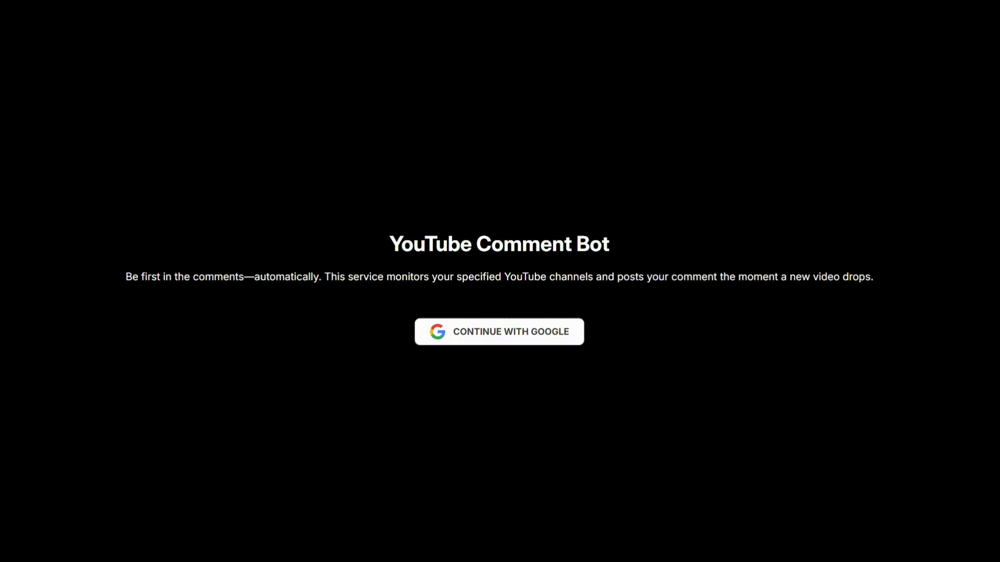

# YouTubeAutoComment

A microservice that monitors specific YouTube channels specified by the user for new video uploads and automatically leaves a comment when a new video is detected—so your friends don’t beat you to the comment section and roast you.

Try it out: https://youtubeautocomment.brookmaodev.me/

## Technologies Used

-   The usual: HTML, CSS, TypeScript, Node.js, Express, and Postgres
-   Deployed to Google Cloud Run using the Dockerfile instructions to build container images
-   Google Cloud Scheduler is used to periodically trigger the Express server’s `/poll` route to “scan” for new uploads from user-specified channels
-   Something I hadn’t worked with before: Google OAuth 2.0, to request access to certain privileges on users' (a.k.a. my own) YouTube accounts so the app can post comments on their behalf

## Build Instructions

Fork and clone the repository, install Docker, run `build.sh` (on Windows, you might need Git Bash to do this), then head to `localhost` to see the app in action.
